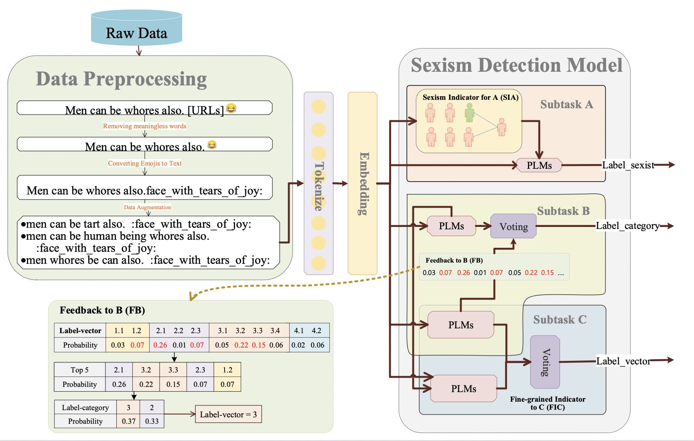

# UIRISC-SemEval2023Task10

This repository contains our work on [SemEval2023-Task10](https://github.com/rewire-online/edos).

## Results

| Subtask | P      | R      | Macro F1 | Rank    |
|---------|--------|--------|----------|---------|
| A       | 0.8536 | 0.8540 | 0.8538   | 19/84   |
| B       | 0.6603 | 0.6635 | 0.6619   | 12/69   |
| C       | 0.4938 | 0.4533 | 0.4641   | 20/63   |

## System Overview



Overview of System of Ensembling Fine-tuning Models (SEFM).

## Requirements

- Python
  - transformers
  - torch
  - numpy
  - datasets
  - pandas
  - matplotlib
  - scipy
  - sklearn
  - cikit-learn

## Dataset

You can download the dataset from: [EDOS](https://github.com/rewire-online/edos).

## Project Structure

Please follow these steps to re-run our experiments:

1. Data argumentation:
   - Run `eda_generate.py`.
2. Detect texts on different LLMs:
   - Run `edos-eda-a.ipynb`.
   - Run `edos-eda-b.ipynb`.
   - Run `edos-eda-c.ipynb`.
3. Voting.
```python
def func(df):
    return stats.mode(df.values)[0][0]
df_pred = df_pred.groupby(by='rewire_id').agg(func).reset_index()
```
4. See our results in the `Results` folder.

## Cite 
```
```
